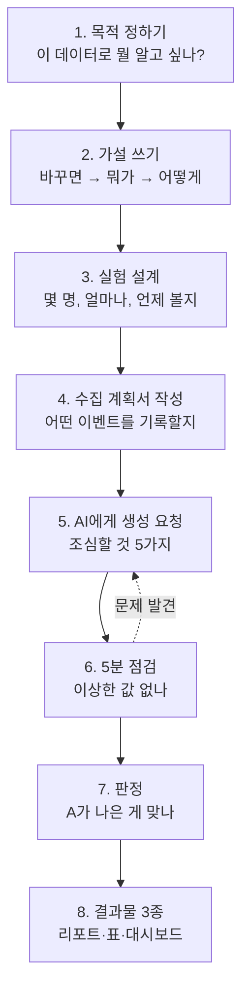

# 데이터 만들기, 처음부터 끝까지

**서비스를 아직 출시하지 않았는데 "데이터로 검증했다"고 말하려면 어떻게 해야 할까?** 이 문서는 그 과정을 처음 해보는 사람을 위한 안내서입니다. 통계를 몰라도 순서대로 따라올 수 있게 썼습니다.

전체 흐름은 이렇습니다.



---

## 1단계. 먼저 물어보세요 — "이 데이터로 뭘 알고 싶은가?"

여기서 모든 게 갈립니다. 목적이 두 가지 중 하나인데, **어느 쪽이냐에 따라 데이터 모양이 완전히 달라집니다.**

### 목적 A. 문제 찾기 — "어디서 사람들이 떠나나?"

> 🪣 **양동이에 구멍이 어디 났는지 찾는 일**입니다. 물을 아무리 부어도 자꾸 줄어드는데, 어디서 새는지 모르는 상황이죠.

- **핵심 질문**: 100명이 들어왔는데 왜 3명만 사고 나가지? 어느 단계에서 가장 많이 빠지지?
- **주인공 지표**: 단계별 **이탈률**, 퍼널 도달률
- **데이터 구조**: 그룹을 나눌 필요 **없습니다.** 한 덩어리 데이터에서 단계별로 몇 명이 남는지만 세면 됩니다
- **결론 모양**: "상품을 본 사람 중 96%가 장바구니에 안 담고 떠난다. 여기가 제일 큰 구멍이다."

### 목적 B. 성과 확인 — "내 아이디어가 진짜 효과 있나?"

> 🏁 **두 방법을 시합 붙이는 일**입니다. 새 방법이 기존 방법보다 정말 나은지 확인하는 거죠.

- **핵심 질문**: 추천 이유를 보여주면 정말 더 많이 살까? 아니면 그냥 기분 탓일까?
- **주인공 지표**: 두 그룹의 **전환율 차이**
- **데이터 구조**: 반드시 **A그룹 / B그룹으로 나눠야** 합니다. 비교 대상이 없으면 "좋아졌다"고 말할 수 없어요
- **결론 모양**: "추천 이유를 본 그룹이 1.44%, 안 본 그룹이 1.13% 구매했다. A가 나을 확률 100%."

### 왜 B에는 꼭 비교 그룹이 필요한가

새 기능을 켜고 전환율이 1.2% → 1.4%로 올랐다고 해봅시다. 이게 기능 덕분일까요?

- 그 사이 광고를 늘렸을 수도 있고
- 계절이 바뀌었을 수도 있고
- 그냥 운이 좋았을 수도 있습니다

**같은 기간에 기능을 안 켠 그룹이 있어야** "다른 조건은 같은데 이것만 달랐다"고 말할 수 있습니다. 이게 A/B 테스트의 전부입니다.

### 이 프로젝트는?

**두 가지를 다 합니다.** 가설이 3개인데, 각 가설마다 "어느 단계에서 떠나는지(퍼널)"와 "A가 B보다 나은지(A/B)"를 함께 봅니다.

---

## 2단계. 가설을 한 문장으로 쓰세요

가설은 **측정 가능한 문장**이어야 합니다. 애매하면 나중에 "그래서 성공한 거야?"에 답할 수 없습니다.

### 공식

> **[무엇을 바꾸면]** → **[어떤 숫자가]** → **[어떻게 변할 것이다]**

| | 문장 | 왜 |
| --- | --- | --- |
| ❌ | "추천을 잘하면 좋을 것이다" | '잘한다'가 뭔지, '좋다'가 뭔지 잴 수 없음 |
| ❌ | "사용자 경험이 개선될 것이다" | 무엇을 재야 할지 모름 |
| ✅ | "추천 이유와 점수를 보여주면 → 구매전환율이 → 15% 오를 것이다" | 바꾸는 것, 재는 것, 기대치가 모두 분명 |

### 가설 하나당 대표 숫자는 딱 하나

가설마다 **"이 숫자로 판정한다"는 주 지표를 1개만** 정하세요. 나머지는 참고용입니다.

왜냐하면 — **숫자를 여러 개 보면 그중 하나는 우연히 좋게 나오기 때문입니다.** 로또를 한 장 사면 당첨 확률이 낮지만, 100장 사면 하나쯤 맞는 것과 같은 이치예요. 지표 7개를 보면 그중 최소 하나가 우연히 좋아 보일 확률이 **52%**나 됩니다.

이 프로젝트의 예시:

| 가설 | 주 지표 (이걸로 판정) | 보조 지표 (참고만) |
| --- | --- | --- |
| 1. 추천 근거를 보여주면 더 산다 | 구매전환율 | 장바구니 전환율 |
| 2. 맞춤 경험이 충성도를 높인다 | 재구매 CVR | NPS, 30일 재구매율, 2회+ 구매 유저 비율 |
| 3. "반영됩니다" 안내가 기록을 늘린다 | 반응 입력완료율 | 알람 확인율 |

---

## 3단계. 실험 설계 — 데이터를 보기 **전에** 정할 4가지

이 순서를 지키는 게 정말 중요합니다. 이유는 아래에서 설명할게요.

### ① 무엇을 다르게 할 것인가

A그룹과 B그룹이 **딱 한 가지만** 달라야 합니다. 여러 개를 동시에 바꾸면 뭐가 효과를 냈는지 알 수 없어요.

```
A그룹(실험군): 추천 상품에 "우리 아이한테 잘 맞아요 92점" + 이유 표시
B그룹(대조군): 추천 상품만 표시, 점수·이유 없음
→ 나머지(가격, 배송, 화면 구성)는 완전히 동일
```

### ② 얼마나 좋아지면 "성공"인가

**데이터를 보기 전에** 정해야 합니다. "1.2%에서 1.25%가 되면 성공인가?" 같은 걸 미리 정하는 거예요.

초기 스타트업이라면 이렇게 생각하면 됩니다: *"이 정도는 올라야 이 기능에 개발 리소스를 계속 쓸 가치가 있다"* — 보통 **상대적으로 15~25% 개선**을 기준으로 잡습니다. (전환율 1.2% → 1.4%면 상대 +17%)

### ③ 몇 명이 필요한가

사람이 적으면 **진짜 효과가 있어도 못 알아봅니다.** 동전을 10번 던져서 앞면이 6번 나왔다고 "이 동전은 앞면이 잘 나온다"고 말할 수 없는 것과 같아요. 1,000번 던져서 600번이면 얘기가 다르죠.

이 프로젝트에서 실제로 겪은 일:

| 그룹당 인원 | 결과 |
| --- | --- |
| 2,500명 | 5개 지표 **전부 판정 불가** ("효과 없음"이 아니라 "알 수 없음") |
| 7,125명 | 여기서부터 판정되기 시작 |
| **9,500명** | 5개 지표 전부 명확히 판정 ✅ |

**⚠️ 함정: 지표마다 필요한 인원이 다릅니다**

깔때기 아래로 갈수록 사람이 줄어들기 때문입니다. 유저 1명이 각 지표에 기여하는 데이터 양:

```
가설1 구매전환율   ████████████████████████ 5.45개  (세션 단위)
가설2 재구매 CVR   ███████████ 2.45개              (추천 클릭 세션)
가설3 입력완료율   ▏0.062개                        (배송완료 주문)
```

가설3은 가설1의 **1/88**입니다. "주문이 있어야 배송이 되고, 배송이 돼야 알람이 나가니까" 그렇습니다. 그래서 유저를 늘려도 가설3 표본은 거의 안 늘어요.

→ **필요 인원은 "가장 표본이 적게 나오는 지표" 기준으로 잡으세요.** 이 프로젝트는 가설3 때문에 9,700명/군이 필요했습니다.

### ④ 결과는 언제, 몇 번 볼 것인가

**정답: 정해둔 인원을 다 모은 뒤, 딱 한 번.**

> 🎲 **왜 한 번인가** — "될 때까지 계속 늘려보자"는 위험합니다. 동전을 던지면서 "앞면이 많이 나온 순간에 멈추자"고 하면, 진짜 공평한 동전이어도 언젠가는 "앞면이 잘 나오는 동전"처럼 보이는 순간이 옵니다. 결과를 보면서 멈출 시점을 정하면 **우연을 실력으로 착각하게 됩니다.**

---

## 4단계. 데이터 수집 계획서 쓰기

이제 "무엇을 기록할지"를 문서로 정리합니다. 이 프로젝트의 실물은 `data/planning/데이터_수집_계획표_V1.xlsx`입니다.

### 계획서에 반드시 들어갈 것

| 항목 | 뭘 쓰나 | 예시 |
| --- | --- | --- |
| **가설** | 2단계에서 쓴 문장 | "추천 근거를 보여주면 구매전환율이 오른다" |
| **주 지표** | 판정에 쓸 숫자 1개 | 구매전환율 |
| **분모/분자** | ⚠️ 가장 많이 빠뜨림 | 분자=결제완료 세션, 분모=진입 세션 |
| **기준치** | 지금은 몇 %인가 + **출처** | 3.60% (Kaggle REES46 등 3개 데이터셋 중앙값) |
| **목표치** | 얼마나 올릴 건가 | +15% |
| **이벤트 목록** | 언제 무엇을 기록하나 | `view_item`, `add_to_cart`, `complete_purchase` |
| **이벤트 속성** | 각 이벤트에 딸린 정보 | `view_item`에 `entry_source`(추천/검색/GNB) |
| **기간·표본** | 며칠, 몇 명 | 90일, 9,500명/군 |

### 여기서 가장 많이 하는 실수 3가지

**❌ 실수 1. "전환율"이라고만 쓴다**

전환율은 항상 **"무엇 대비"**가 있어야 합니다. 같은 이름인데 분모가 다르면 완전히 다른 숫자가 나와요.

```
"재구매율 10%"  ← 무엇 대비?
  · 전체 유저 대비인가?
  · 한 번이라도 산 사람 대비인가?
  · 60일 이상 관찰된 사람 대비인가?
→ 이 프로젝트에선 이 차이 때문에 표본이 62명 vs 9,500명으로 150배 차이가 났습니다
```

**❌ 실수 2. 이벤트 이름을 여기저기 다르게 쓴다**

계획서엔 `상품조회`, 코드엔 `view_item`, 리포트엔 `상품 상세 진입`... 이러면 나중에 누구도 같은 걸 말하는지 확신할 수 없습니다. **영문 이벤트명을 하나 정하고 계획서·코드·리포트가 전부 그걸 쓰게** 하세요.

**❌ 실수 3. 기준치 출처를 안 적는다**

"조회→장바구니 3.6%"라고만 적혀 있으면, 6개월 뒤에 아무도 이 숫자가 어디서 왔는지 모릅니다. **어디서 가져왔는지, 가정이면 가정이라고** 반드시 적으세요. 이 프로젝트는 모든 숫자에 "Kaggle 실측" 또는 "가정(명시)" 딱지를 붙였습니다.

---

## 5단계. AI에게 데이터 생성 요청하기

### 요청할 때 이렇게 쓰세요

```
[계획서 첨부]

이 계획서대로 90일치 가상 운영 데이터를 만들어줘.

조건:
- A/B 각 9,500명, 총 19,000명
- 계획서의 이벤트 목록·속성을 그대로 따를 것
- 각 확률값이 "실측에서 가져온 것"인지 "우리가 정한 가정"인지
  코드 주석과 README에 구분해서 표시할 것
- 난수 시드를 고정해서 다시 돌려도 같은 결과가 나오게 할 것
- 생성 후 카테고리 분포·가격대가 상식적인지 점검하는 코드도 같이 줘
```

**핵심은 마지막 두 줄입니다.** 시드 고정은 재현성을, 점검 코드는 아래 함정들을 잡아줍니다.

### ⚠️ 조심할 것 5가지 — 실제로 다 겪은 일입니다

**① "실측"과 "가정"을 반드시 구분시키세요**

가상 데이터는 결국 **누군가 정한 확률**로 만들어집니다. 그 확률이 어디서 왔는지 구분이 안 되면, 나중에 "이 결과 믿어도 되나요?"에 답할 수 없어요.

- 실측: Kaggle 공개 데이터에서 실제로 집계 → 조회→장바구니 3.60%
- 가정: 우리 앱 고유 기능이라 비교 대상이 없음 → 반응 입력률 5%

**② 두 파일이 글자로 주고받는 곳을 의심하세요**

실제로 있었던 버그:

```
01번 스크립트: 모든 종에 맞는 상품을 "dog/cat" 이라고 저장
02번 스크립트: "both" 라는 글자를 찾아서 상품을 고름
→ 서로 다른 글자라 못 찾음
→ 상품 91개 중 77개가 한 번도 안 팔림
→ 주문 345건이 전부 '간식' 카테고리였음
```

**막는 법**: 생성 직후 `카테고리별 주문 수`를 세어보세요. 상품 구성비랑 비슷해야 정상입니다.

**③ 숫자가 상식적인지 눈으로 보세요**

또 있었던 일: 간식 평균 가격이 **47,000원**으로 나왔습니다. 사료보다 비싼 간식이죠. AI는 시키는 대로 범위를 넣었을 뿐이고, 그 범위가 현실과 안 맞았던 겁니다.

**막는 법**: 카테고리별 평균 가격, 평균 주문 금액 같은 걸 **실제 시장 가격과 비교**해보세요. 자릿수만 봐도 이상한 게 보입니다.

**④ 다시 만들면 모든 숫자가 바뀝니다**

이게 가장 놀라운 부분입니다. 버그 하나를 고치고 다시 돌렸더니:

| | 수정 전 | 수정 후 |
| --- | --- | --- |
| 주문 수 | 345건 | 381건 |
| 가설1 장바구니 전환 | A 3.8% > B 3.6% | A 3.63% **<** B 3.82% |

**A와 B의 승패가 뒤집혔습니다.** 난수가 한 줄로 이어져 있어서, 중간의 값 하나만 달라져도 그 뒤가 전부 새로 뽑히기 때문입니다.

**막는 법**: 재생성했으면 **모든 산출물의 숫자를 다시 뽑으세요.** 문서만 고치고 표를 안 고치면 팀이 서로 다른 숫자를 보게 됩니다.

**⑤ AI가 계산한 것도 검산하세요**

이번에 AI(저)가 실제로 틀린 것: 효과크기를 세 가설 모두 "+15%"로 계산했는데, 실제로는 **퍼널 단계마다 곱해져서** 달랐습니다.

```
가설3의 진짜 효과크기:
  B: 0.18 × 0.78                 = 14.04%
  A: (0.18×1.15) × (0.78×1.15)   = 18.57%
  → +32.2%   ("+15%"가 아님!)
```

이 오류 때문에 "표본이 부족하다"고 잘못 결론 낼 뻔했습니다.

**막는 법**: 중요한 숫자는 **손으로 한 번 계산**해서 데이터와 맞춰보세요. 위 14.04%는 실측 13.97%와 거의 같으니 계산이 맞은 겁니다.

---

## 6단계. 생성 직후 5분 점검

데이터가 나오면 바로 이것부터 확인하세요.

```python
import pandas as pd
orders = pd.read_csv("data/generated_v2/orders.csv")
products = pd.read_csv("data/generated_v2/products_master.csv")
m = orders.merge(products[["product_id","category_code","price_krw"]], on="product_id")

print(m.category_code.value_counts())              # ① 한 곳에 쏠렸나?
print(m.groupby("category_code").price_krw.mean()) # ② 가격이 상식적인가?
print(orders.groupby("group").size())              # ③ A/B가 비슷한가?
```

| # | 확인할 것 | 이상 신호 |
| --- | --- | --- |
| ① | 카테고리 분포 | 한 카테고리가 100% 차지 → 필터 버그 |
| ② | 카테고리별 평균가 | 간식이 사료보다 비쌈 → 가격 설정 오류 |
| ③ | A/B 그룹 크기 | 한쪽이 2배 많음 → 배정 로직 오류 |
| ④ | 퍼널 각 단계 수 | 아래 단계가 위 단계보다 많음 → 집계 오류 |
| ⑤ | 주 지표 표본 수 | 100건 미만 → 판정 불가, 표본 늘려야 함 |

---

## 7단계. 결과 판정하기

### 쓰는 기준: "A가 B보다 나을 확률"

어려운 통계 용어 대신, **"A가 B보다 나을 확률이 몇 %인가"** 하나만 봅니다. 이걸 P(A>B)라고 씁니다.

> 🎯 **90% 이상이면 통과.** 100번 중 90번은 A가 낫다는 뜻입니다.

이 프로젝트 결과:

| 가설 | A | B | A가 나을 확률 | 판정 |
| --- | --- | --- | --- | --- |
| 1. 구매전환율 | 1.44% | 1.13% | **100%** | ✅ |
| 2. 재구매 CVR | 1.68% | 1.24% | **100%** | ✅ |
| 3. 입력완료율 | 19.60% | 13.97% | **99.7%** | ✅ |

계산 코드는 몇 줄이면 됩니다.

```python
import numpy as np
RNG = np.random.default_rng(20260909)   # 시드 고정 (매번 같은 값이 나오도록)

def a_가_나을_확률(a_성공, a_전체, b_성공, b_전체):
    a = RNG.beta(1 + a_성공, 1 + a_전체 - a_성공, 200_000)
    b = RNG.beta(1 + b_성공, 1 + b_전체 - b_성공, 200_000)
    return round(100 * (a > b).mean(), 1)

a_가_나을_확률(755, 52339, 587, 51731)   # → 100.0
```

### 판정할 때 지켜야 할 2가지

**① 가설당 주 지표 1개만** — 2단계에서 정한 그 지표로만 판정합니다. 보조 지표는 "방향이 같은지" 참고만 하세요.

**② 가드레일 — 좋아졌어도 다른 게 나빠지면 멈춤**

전환율이 올랐다고 무조건 좋은 게 아닙니다. 억지로 사게 만들어놓고 만족도가 떨어졌다면 장기적으로 손해예요.

| 감시 지표 | 이러면 보류 |
| --- | --- |
| NPS(만족도) | A가 B보다 5점 이상 낮음 |
| 장바구니→구매 이탈률 | A가 5%p 이상 높음 |
| 상품 상세 체류시간 | A가 30% 이상 급증 (헤맨다는 신호) |

### "판정 불가"도 정직한 결과입니다

표본이 부족하면 **"효과 없음"이 아니라 "알 수 없음"**입니다. 이 둘은 완전히 다릅니다. 이 프로젝트도 처음엔 5개 지표 전부 판정 불가였고, 표본을 3.8배 늘려서야 판정할 수 있었습니다.

---

## 8단계. 결과물 만들기

세 가지를 만들고, **셋의 숫자가 반드시 일치해야** 합니다.

| 결과물 | 누가 보나 | 담는 것 |
| --- | --- | --- |
| **분석 리포트** (`.md`) | 팀 전체, 심사위원 | 퍼널·판정·해석 전문 |
| **종합표** (`.xlsx`) | 데이터 확인하는 사람 | 지표 비교표, 판정결과 시트, 원본 수치 |
| **인터랙티브 리포트** (아티팩트) | 발표·공유용 | 차트, 호버 툴팁 |

### 리포트에 반드시 들어갈 것

가설마다 이 순서로 씁니다.

1. **퍼널 정의** — A와 B가 각 단계에서 뭘 보는지 표로
2. **단계별 도달률** — 몇 명이 각 단계에 도달했나 (비율 + 실제 인원)
3. **이탈 구간 Top 3** — 어디서 가장 많이 떠나나
4. **활성 vs 이탈 세그먼트** — 산 사람과 안 산 사람이 뭐가 달랐나
5. **판정 결과** — A가 나을 확률과 통과 여부

그리고 마지막에 **두 가지 해석**을 꼭 붙이세요. 숫자만 있으면 "그래서 뭘 하라고?"가 남습니다.

**📌 KPI 검증에서의 의미** — 무엇이 검증됐고, 그래서 이 방향으로 가도 되는지

> 예시: "구매전환율이 1.13% → 1.44%로 올랐고, 개인화를 적용한 단계뿐 아니라 그 다음 결제 단계 이탈률까지 낮아졌습니다. 개인화는 단일 지표를 밀어올리는 기능이 아니라 구매 여정 전체의 질을 바꾸는 기능으로 봐야 합니다."

**⚠️ 한계점에서의 의미** — 무엇이 아쉬웠고, 다음에 뭘 고쳐야 하는지

> 예시: "재진입이 A 2건 / B 0건이라 '데이터를 모으면 재방문으로 이어지는가'라는 가설의 최종 목적은 확인하지 못했습니다. 알람이 배송완료 주문에만 나가 표본이 구조적으로 부족합니다."

### 한계를 쓰는 게 오히려 신뢰를 줍니다

"모든 게 완벽했다"는 리포트는 아무도 안 믿습니다. **무엇을 몰랐는지 정확히 아는 것**이 데이터를 제대로 다뤘다는 증거예요.

---

## 자주 하는 질문

**Q. 가상 데이터로 검증하는 게 의미가 있나요?**

가상 데이터로 증명할 수 있는 건 "우리 가설이 맞다"가 아니라 **"우리가 이 가설을 검증할 준비가 됐다"**입니다. 어떤 이벤트를 남겨야 하는지, 몇 명이 필요한지, 어떤 기준으로 판정할지를 미리 정리해두는 거죠. 실제 서비스가 열리면 같은 파이프라인에 진짜 데이터를 넣기만 하면 됩니다.

**Q. 표본을 늘리면 항상 유의하게 나오는 거 아닌가요?**

가상 데이터에서는 **그렇습니다.** 우리가 "+15% 효과가 있다"고 코드에 넣어놨으니 표본만 충분하면 당연히 검출됩니다. 하지만 실제 데이터에서는 효과가 진짜 있는지 아무도 모릅니다. 그래서 표본을 늘리는 이유가 다릅니다 — **"유의하게 만들려고"가 아니라 "있는지 없는지 판단할 수 있게 하려고"** 늘리는 겁니다.

**Q. 기간을 못 늘리면 어떻게 하나요?**

**분모를 바꿔보세요.** 이 프로젝트에서 60일 재구매율은 표본이 62명뿐이라 판정 불가였는데, 같은 질문을 "2회 이상 구매한 유저 비율"로 바꾸니 분모가 전체 유저 9,500명이 되어 판정이 가능해졌습니다. 기간이 아니라 **측정 방식**이 문제인 경우가 많습니다.

**Q. AI가 만든 데이터를 그냥 믿어도 되나요?**

안 됩니다. 이 프로젝트에서만 버그 2건 + 계산 오류 1건이 나왔습니다. **6단계 5분 점검은 반드시 하세요.** 특히 "상식적으로 말이 되는 숫자인가"는 사람이 봐야 잡힙니다.

---

## 더 볼 문서

| 문서 | 언제 보나 |
| --- | --- |
| [`데이터_파이프라인_운영_가이드.md`](데이터_파이프라인_운영_가이드.md) | 실제로 스크립트를 돌리고 고칠 때 (기술 상세) |
| [`가설1_가설2_가설3_퍼널_분석_리포트.md`](가설1_가설2_가설3_퍼널_분석_리포트.md) | 완성된 리포트가 어떻게 생겼는지 볼 때 |
| [`../data/generated_v2/README.md`](../data/generated_v2/README.md) | 어떤 숫자가 실측이고 어떤 게 가정인지 확인할 때 |
| [`../data/planning/데이터_수집_계획표_V1.xlsx`](../data/planning/데이터_수집_계획표_V1.xlsx) | 계획서 실물 예시가 필요할 때 |
