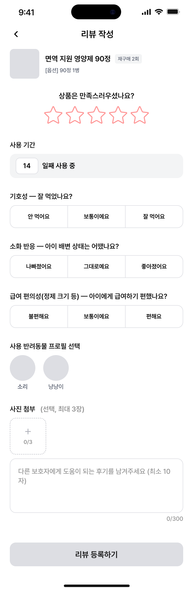

# 리뷰 작성

기능그룹: 리뷰
상위 항목: 리뷰 탭 | 리뷰 페이지 (%EB%A6%AC%EB%B7%B0%20%ED%83%AD%20%EB%A6%AC%EB%B7%B0%20%ED%8E%98%EC%9D%B4%EC%A7%80%208ba7659d7db7838da27481497c72c3db.md)
세부 그룹: 리뷰 작성
우선순위/논의 사항: 높음(2순위)

- [표시]
    - 상품 정보 (대표 사진, 상품명, 옵션)
    - 재구매 횟수
        - 시스템: 구매확정된 상품 확인해 재구매 여부 자동 계산
- [터치]
    - 별점(필수)
        - 1~5점
        - 0.5점 간격
        - 드래그 선택
    - 사용 기간 입력란 (필수)
        - **[기본] 구매확정일부터 리뷰 작성일까지**
            - 구매확정일부터 리뷰 작성일까지의 구간보다 길게 설정 불가능
        - [터치] 숫자 키패드 등장
            - 입력 활성화, 구매확정일부터 리뷰 작성일까지 숫자 배경으로 노출
            - 숫자 입력 시, 구매확정일부터 리뷰 작성일까지 숫자 미노출
            - 숫자만 입력 가능
        - [다른 화면 터치] 입력값 저장
    
    - 기호성 버튼 (`필수`)
        - 안 먹어요, 보통이에요, 잘 먹어요 중 1택
    - 소화 반응 버튼 (`필수`)
        - 나빠졌어요, 그대로에요, 좋아졌어요 중 1택
    - 급여 편의성 버튼 (`필수`)
        - 불편해요, 보통이에요, 편해요 중 1택
    - 사용 반려동물 프로필 선택 (`필수`)
        - 시스템: 등록된 프로필 사진 불러옴
        - 등록된 프로필 중 선택
    - 텍스트 리뷰 입력란 (`선택`)
        - 최대 300자
        - 최소 0자
        - 텍스트 입력 시 ‘글자수/300’ 표시
    - 사진 등록 (`선택`)
        - 최대 3장
        - [터치] 갤러리 등장

- [리뷰 등록] 버튼
    - 리뷰 작성이 된 경우 → 리뷰 작성 완료 확인 페이지 (4초 노출)
- **필수부분 입력 안 되어 있을 시 ‘리뷰 등록’ 버튼 비활성화**