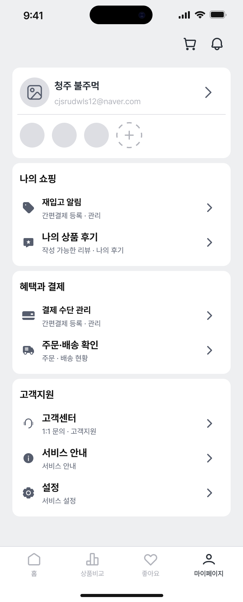

# 반려동물 프로필 조회

기능그룹: 마이페이지홈
기능 짧은 desciption: 반려동물 추가 시 업로드 하는 사진, 반려동물 이름
상위 항목: 제목 없음 (%EC%A0%9C%EB%AA%A9%20%EC%97%86%EC%9D%8C%2029d7659d7db783219f6a8199936c63eb.md)
세부 그룹: 홈
우선순위: 매우높음(1순위)

- [표시] 반려동물 추가 시 업로드 하는 사진
    - 사진 미등록 시, 기본 배경에 반려동물 이름 앞에서 두 글자 표시 (ex. 바라나리 → (바라)
    - [터치] 해당 반려동물의 ‘마이프로필 화면’으로 이동
    - 최대 4마리까지 표시